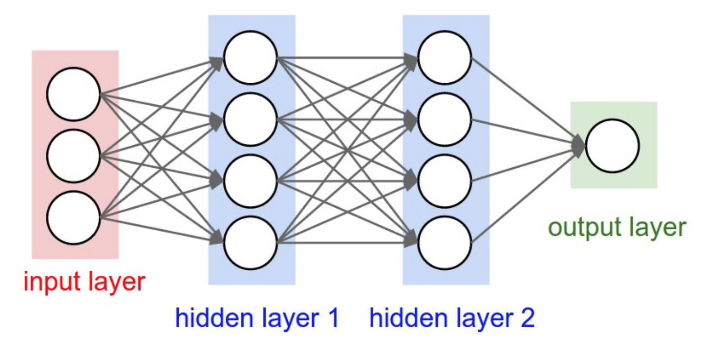
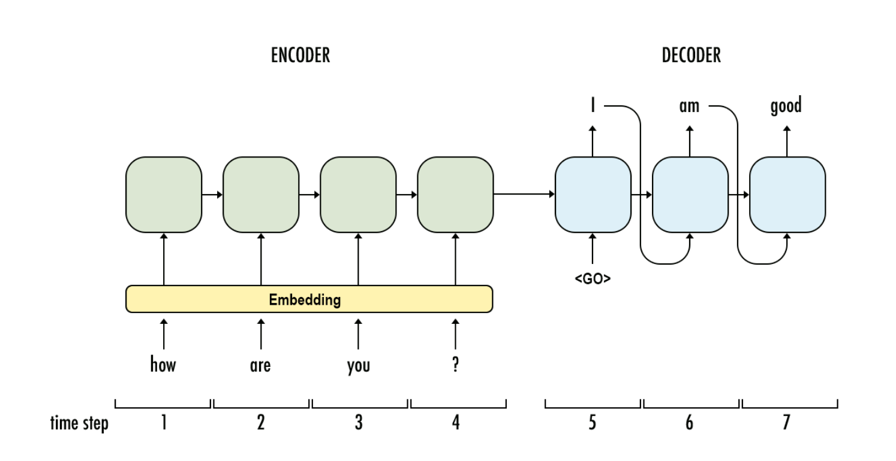
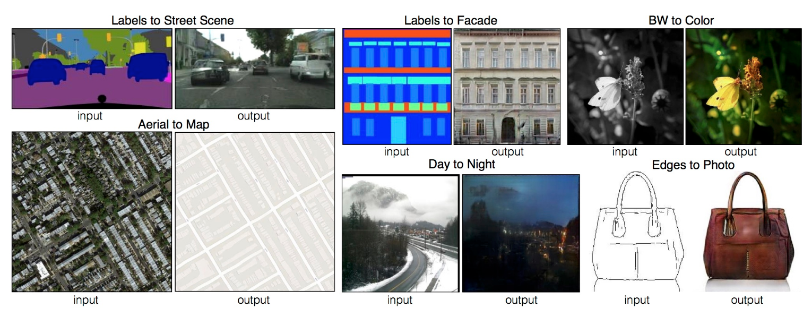
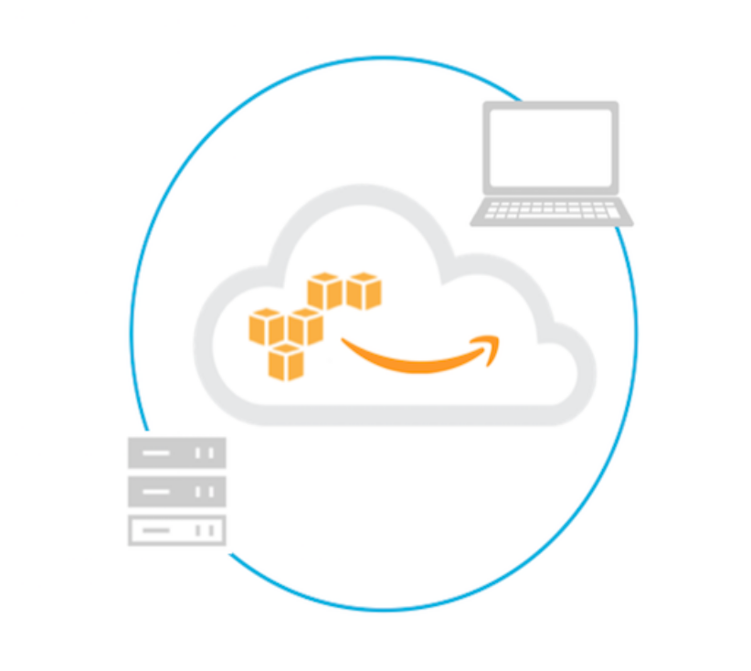

# Deep Learning

## Program Structure
The Deep Learning Nanodegree program is divided into five parts, giving you a thorough understanding of deep learning, and covering some of the major topics.

## Introduction
The first part is an introduction to the program as well as a couple lessons covering tools you'll be using. You'll also get a chance to apply some deep learning models to do cool things like transferring the style of artwork to another image.

We’ll start off with a simple introduction to linear regression and machine learning. This will give you the vocabulary you need to understand recent advancements, and make clear where deep learning fits into the broader picture of machine learning techniques.

## Neural Networks
In this part, you'll learn how to build a simple neural network from scratch using python. We'll cover the algorithms used to train networks such as gradient descent and backpropagation.



The __first project__ is also available this week. In this project, you'll predict bike ridership using a simple neural network.

### Sentiment Analysis
You'll also learn about model evaluation and validation, an important technique for training and assessing neural networks. We also have guest instructor Andrew Trask, author of [Grokking Deep Learning](https://www.manning.com/books/grokking-deep-learning), developing a neural network for processing text and predicting sentiment. The exercises in each chapter of his book are also available in his [Github repository](https://github.com/iamtrask/Grokking-Deep-Learning).

### Deep Learning with PyTorch
The last lesson will be all about using the deep learning framework, PyTorch. Here, you'll learn how to use the Tensor datatype, and the foundational knowledge you'll need to define and train your own deep learning models in PyTorch!

## Convolutional Networks
Convolutional networks have achieved state of the art results in computer vision. These types of networks can detect and identify objects in images. You'll learn how to build convolutional networks in PyTorch.

You'll also get the __second project__, where you'll build a convolutional network to classify dog breeds in pictures.


You'll also use convolutional networks to build an autoencoder, a network architecture used for image compression and denoising. Then, you'll use a pre-trained neural network, to classify images the network has never seen before, a technique known as transfer learning.

## Recurrent Neural Networks
In this part, you’ll learn about Recurrent Neural Networks (RNNs) a type of network architecture particularly well suited to data that forms sequences like text, music, and time series data. You'll build a recurrent neural network that can generate new text character by character.


### Natural Language Processing
Then, you'll learn about word embeddings and implement the Word2Vec model, a network that can learn about semantic relationships between words. These are used to increase the efficiency of networks when you're processing text.

You'll combine embeddings and an RNN to predict the sentiment of movie reviews, an example of common tasks in natural language processing.

In the __third project__, you'll use what you've learned here to generate new TV scripts from provided, existing scripts.



### Generative Adversarial Networks
Generative adversarial networks (GANs) are one of the newest and most exciting deep learning architectures, showing incredible capacity for understanding real-world data. In this part, you'll learn about and implement GANs for a variety of tasks. You'll even see how to code a [CycleGAN](https://github.com/junyanz/CycleGAN) for generating images, and learn from one of the creators of this formulation, Jun-Yan Zhu, a researcher at [MIT's CSAIL](https://www.csail.mit.edu/).



The inventor of GANs, Ian Goodfellow, will show you how GANs work and how to implement them. Then, in the __fourth project__, you'll use a deep convolutional GAN to generate completely new images of human faces.


## Deploying Machine Learning Models
As more and more companies look to build AI products, there is a growing demand for engineers who are able to deploy machine learning models to global audiences. In this part, you’ll get experience deploying a model so that it can be accessed via a web app and respond to user input.



You'll also learn to monitor a model using PyTorch and Amazon's SageMaker. In the fifth project, you will deploy your own PyTorch sentiment analysis model and create a gateway for accessing this model from a website.


## Projects You Will Build
The five projects you'll complete in this course are perhaps the most important part of your learning journey. They give you the chance to apply what you've learned and even share your work with friends or potential employers! These projects are designed to be challenging and interesting, as such, you may not always pass on the first attempt, but, if you are enrolled in our complete program, you will get feedback from a real person; a Udacity reviewer. This reviewer will help you figure out what could be improved in your code and you can submit your code again until you pass the project.

Here are the five projects, listed for convenience:

```
1. Predicting Bike-Sharing Data
2. Dog Breed Classifier
3. Generate TV Scripts
4. Generate Faces
5. Deploy a Sentiment Analysis Model
```

You are also encouraged to keep a public portfolio of completed project code on a personal Github or write a blog posts about your problem-solving approach.


## Prerequisites
We've designed this program such that you only require the following prerequisite knowledge:


Required

- [Intermediate Python experience.](https://www.udacity.com/course/introduction-to-python--ud1110)

Optional

- [Multivariable Calculus](https://www.khanacademy.org/math/multivariable-calculus) and [Linear Algebra](https://www.khanacademy.org/math/linear-algebra) if possible.

That being said, we've included a lot of the detailed mathematics for those of you who do want to go in depth and understand the theory behind these concepts. Such content is optional and shouldn't prevent you from doing the projects. However, it is encouraged for a theoretical understanding.

## Github Repos

- [Deep Learning](https://github.com/udacity/deep-learning)
- [Deep Learning with Pytorch](https://github.com/udacity/deep-learning-v2-pytorch)
