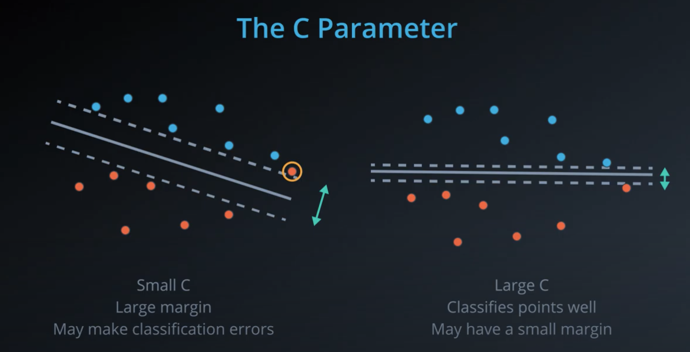

## Recap

In this lesson, you learned about Support Vector Machines (or SVMs). SVMs are a popular algorithm used for classification problems. You saw three different ways that SVMs can be implemented:

1. Maximum Margin Classifier
2. Classification with Inseparable Classes
3. Kernel Methods

### Maximum Margin Classifier

When your data can be completely separated, the linear version of SVMs attempts to maximize the distance from the linear boundary to the closest points (called the support vectors). For this reason, we saw that in the picture below, the boundary on the left is better than the one on the right.

### Classification with Inseparable Classes

Unfortunately, data in the real world is rarely completely separable as shown in the above images. For this reason, we introduced a new hyper-parameter called __C__. The __C__ hyper-parameter determines how flexible we are willing to be with the points that fall on the wrong side of our dividing boundary. The value of __C__ ranges between 0 and infinity. When __C__ is large, you are forcing your boundary to have fewer errors than when it is a small value.

__Note: when C is too large for a particular set of data, you might not get convergence at all because your data cannot be separated with the small number of errors allotted with such a large value of C.__

### Kernels
Finally, we looked at what makes SVMs truly powerful, kernels. Kernels in SVMs allow us the ability to separate data when the boundary between them is nonlinear. Specifically, you saw two types of kernels:

- polynomial
- rbf

By far the most popular kernel is the __rbf__ kernel (which stands for radial basis function). The rbf kernel allows you the opportunity to classify points that seem hard to separate in any space. This is a density based approach that looks at the closeness of points to one another. This introduces another hyper-parameter __gamma__. When __gamma__ is large, the outcome is similar to having a large value of C, that is your algorithm will attempt to classify every point correctly. Alternatively, small values of __gamma__ will try to cluster in a more general way that will make more mistakes, but may perform better when it sees new data.

### Resources

[Support Vector Machines are described in Introduction to Statistical Learning starting on page 337.](http://faculty.marshall.usc.edu/gareth-james/)

[The wikipedia page related to SVMs](https://en.wikipedia.org/wiki/Support-vector_machine)

[The derivation of SVMs from Stanford's CS229 notes.](./cs229-notes3.pdf)
